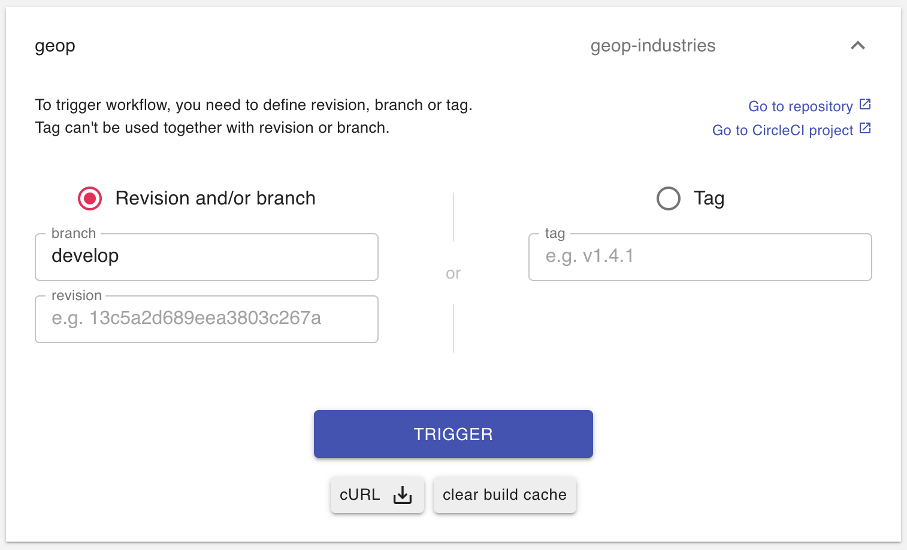

# Trigger workflow

Simple CircleCI API client app

## What does it do?

It helps to trigger CircleCI workflow.

## Who is it for?

It is created for developers who use CircleCI as their continuous integration platform.

## Why is it useful?

It offers new way of triggering workflows. 
Until now to achieve it developers had to:

- push new commit
- create pull request
- retry one of the previous workflows
- redeliver request from Github/Bitbucket to CircleCI
- manually compose and invoke cURL request to CircleCI API

Sometimes there is a need to rerun workflow for one of the earlier versions of an application (which can be really hard to find in the history), there is a downtime of connection between Github/Bitbucket and CircleCI (thus no build hooks after push/pull request) or developer has just pushed new version of `config.yml` and wants to build specific version of the app using it.

**This app makes it easy.**

## How does it work?

The app makes two CircleCI API request

- `GET https://circleci.com/api/v1.1/projects`
- `POST https://circleci.com/api/v1.1/project/:vcs-type/:username/:project/build`

Unfortunately, CircleCI API doesn't accept cross-domain POST requests (_CORS_). That's why to trigger workflow such request has to be sent through https://cors-anywhere.herokuapp.com/ service.

If you are afraid of passing your CircleCI token to a third-party, you can either only use "cURL" download button (and paste command in terminal) or launch Trigger workflow locally with your own CORS proxy.

## Community

Everyone is welcome to create pull request with new features or fixes. Please let me know if you find this app useful by starring it on Github or simply messaging me on Twitter.
